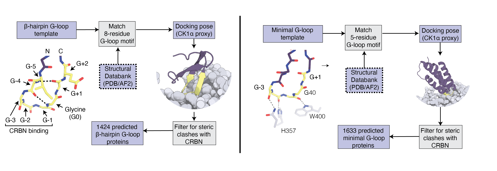

# G-loop Mining

This repository contains the source code, data, and scripts related to the research on **β-hairpin G-loop motifs** and **minimal G-loop motifs** involved in CRBN neosubstrate recognition. This project predicts and validates CRBN-compatible β-hairpin and helical G-loop proteins, contributing to our understanding of molecular glue degraders and their impact on neosubstrate recruitment. This repository reproduces the results of *Mining the CRBN Target Space Redefines Rules for Molecular Glue-induced Neosubstrate Recognition* (see Reference below).

## Overview

The scripts in this repository enable **mining of G-loop motifs** across protein structures derived from PDB and AlphaFold2 models, based on the β-hairpin G-loop around glycine in CK1α. Identified motifs are further processed and validated for CRBN engagement using various biochemical assays.

### Key Features

- **Parallelized mining**: Efficiently process thousands of structural motifs using the provided Bash script, which parallelizes Python script execution across multiple cores.
- **Motif validation**: Predictions are filtered based on structural compatibility with CRBN.
- **Datasets**: Minimal test datasets are included in this repository. The full list of PDB structures are available at zenodo.org/XXX.
  


## Installation

To run this code, clone the repository and install the required dependencies:

```bash
git clone git@github.com:monterosatx/gloop-mining.git
cd gloop-mining
./build_docker.sh
```

## Running the code

```
./run_docker.sh
cd {/your/gloop/directory}
./run_test.sh
```


## Running the mining for the full proteome. 

First download the AF2 and PDB models from zenodo:

Then, run the full list:

```./run_all_list.sh```

# Reference

_*Mining the CRBN Target Space Redefines Rules for Molecular Glue-induced Neosubstrate Recognition*_
*Authors*: Georg Petzold, Pablo Gainza, Stefano Annunziato, Ilaria Lamberto, Peter Trenh, Laura A. McAllister, Bradley DeMarco, Laura Schwander, Richard D. Bunker, Mary Zlotosch, Rohitha SriRamaratnam, Samuel Gilberto, Gerasimos Langousis, Etienne J. Donckele, Chao Quan, Vaik Strande, Gian Marco De Donatis, Shanique B. Alabi, Jessica Alers, Michelle Matysik, Camille Staehly, Aurelie Dubois, Arnaud Osmont, Mackenzie Garskovas, David Lyon, Lars Wiedmer, Vladimiras Oleinikovas, Raphael Lieberherr, Nooreen T. Rubin, Daniel T. Lam, Nina Ilic Widlund, Andreas Ritzen, Ramon Miguel Caceres, Dominico Vigil, Jennifer Tsai, Owen Wallace, Marisa Peluso, Amine Sadok, Alison Paterson, Vladislav Zarayskiy, Bernhard Fasching, Debora Bonenfant, Markus Warmuth, John Castle, Sharon A. Townson
_bioRxiv 2024.10.07.616933; doi: https://doi.org/10.1101/2024.10.07.616933_
